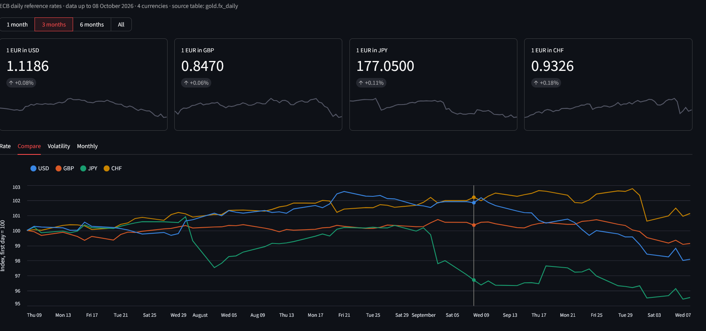
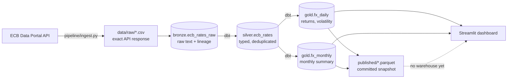

# ECB FX Pipeline

[](https://github.com/fisherynwa/ecb-fx-pipeline/actions/workflows/ci.yml)


A daily data pipeline for the European Central Bank's euro reference exchange
rates, built without a database server. Python loads the raw data into DuckDB,
dbt builds and tests the analytics tables, Airflow schedules the run, and a
Streamlit dashboard shows the result.



The whole warehouse is a single DuckDB file, so there is nothing to install or
start besides Python packages: clone, `uv sync`, run.

**Just want to see it?** The gold tables are committed as Parquet files in
`published/`, so the dashboard works straight after cloning:

```bash
git clone https://github.com/fisherynwa/ecb-fx-pipeline.git
cd ecb-fx-pipeline
uv sync
uv run streamlit run app/streamlit_app.py
```

## Architecture



Airflow runs the pipeline on weekdays at 17:00 Berlin time, after the ECB
publishes its rates (around 16:00 CET):

```
ingest_to_bronze  >>  dbt_source_freshness  >>  dbt_build
```

| Layer | Tool | What it holds |
|---|---|---|
| Raw files | Python | Every API response, saved byte for byte |
| Bronze | Python + DuckDB | All values as text, plus `_source_file` and `_loaded_at` |
| Silver | dbt | Real types, one row per currency and day (newest load wins) |
| Gold | dbt | Daily returns, 20-day volatility, monthly averages |
| Published | Python + DuckDB | Gold tables as Parquet, committed to git |
| Dashboard | Streamlit + Altair | Reads gold only: the warehouse, or the Parquet snapshot |

## Quick start

Requirements: [uv](https://docs.astral.sh/uv/). Docker only for the optional
Airflow part.

```bash
git clone https://github.com/fisherynwa/ecb-fx-pipeline.git
cd ecb-fx-pipeline
uv sync

uv run python -m pipeline.ingest      # ECB API -> raw file -> bronze

cd dbt
uv run dbt build                      # silver + gold, with all data tests
uv run dbt source freshness           # is the newest rate recent enough?
cd ..

uv run python -m pipeline.export      # gold -> published/*.parquet
uv run streamlit run app/streamlit_app.py
```

The first run fetches everything from `start_period` in `config.yaml`. Later
runs fetch only the last few days. Currencies, dates and paths are all set in
`config.yaml`.

### Scheduling with Airflow

```bash
docker compose up -d --build          # Airflow UI: http://localhost:8090
```

Switch on the `ecb_fx_daily` DAG in the UI. The container mounts the project
folder, so it reads the same `config.yaml` and writes the same DuckDB file.

## Project structure

```
ecb-fx-pipeline/
├── config.yaml              Currencies, start date, paths, lookback window
├── pipeline/                Ingestion (Python)
│   ├── config.py            config.yaml -> frozen dataclass
│   ├── extract.py           ECB API -> raw CSV file
│   ├── load.py              raw CSV -> bronze, each file loaded once
│   ├── ingest.py            incremental extract + load
│   └── export.py            gold -> Parquet snapshot
├── dbt/                     Transformations and data tests
│   ├── models/sources.yml   bronze as a source, with a freshness check
│   ├── models/silver/       ecb_rates
│   ├── models/gold/         fx_daily, fx_monthly
│   └── tests/               custom data tests
├── airflow/                 Image and DAG for scheduling
├── app/                     Streamlit dashboard
│   ├── data.py              queries and data shaping (tested)
│   └── streamlit_app.py     the page
├── published/               Gold tables as Parquet (committed)
├── tests/                   pytest tests and a synthetic sample file
├── docker-compose.yml       Airflow in one container
└── .github/workflows/ci.yml
```

## Design decisions

- **Bronze stores everything as text, exactly as delivered.** A single bad
  value can't make the load fail, and nothing is reformatted. Type conversion
  happens in silver with `TRY_CAST`, where bad values are dropped on purpose
  and tested.
- **Lineage columns on every row.** `_source_file` and `_loaded_at` record where
  each row came from and when. They drive deduplication and make it possible
  to trace or remove a bad load.
- **Incremental load with a 7-day lookback.** Each run starts a week before the
  newest date already loaded, so corrections the ECB makes to recent days are
  picked up. The duplicates this creates in bronze are resolved in silver with
  `row_number()`, keeping the newest load.
- **Idempotent at every step.** A raw file is loaded once, and silver and gold
  are rebuilt from bronze on every run, so a retry or a manual rerun leaves
  the data in the same state. Adding a currency only needs one backfill run.
- **Tests gate the layers.** `dbt build` tests silver before building gold; if a
  test fails, the gold tables are skipped and keep their last good version.
- **One writer at a time.** DuckDB allows a single writer, so the DAG runs with
  `max_active_runs=1`, and the dashboard opens the file read-only, closes it
  after each query and caches results for five minutes.
- **A committed Parquet snapshot of gold.** The warehouse file stays out of git,
  but the gold tables are small, so they are exported to Parquet and
  committed. The export sorts rows the same way every time, so the files only
  change when the data does, and anyone can open the dashboard without
  running the pipeline.


```bash
uv run pytest -v
```

## Data

Euro foreign exchange reference rates from the
[ECB Data Portal](https://data.ecb.europa.eu/) (dataset `EXR`), published on
TARGET business days at around 16:00 CET. Source: European Central Bank.

## License

[MIT](LICENSE)
